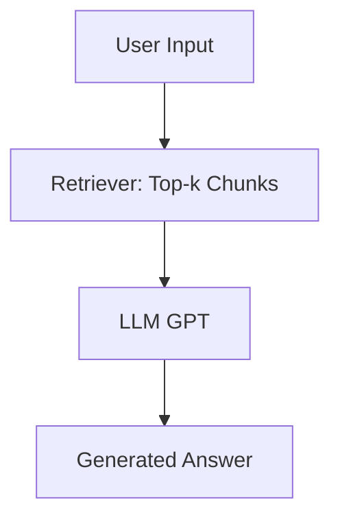
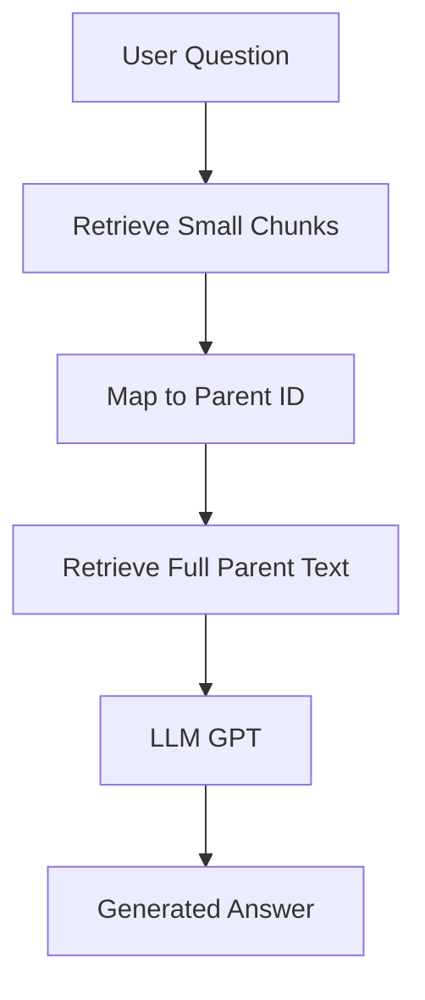
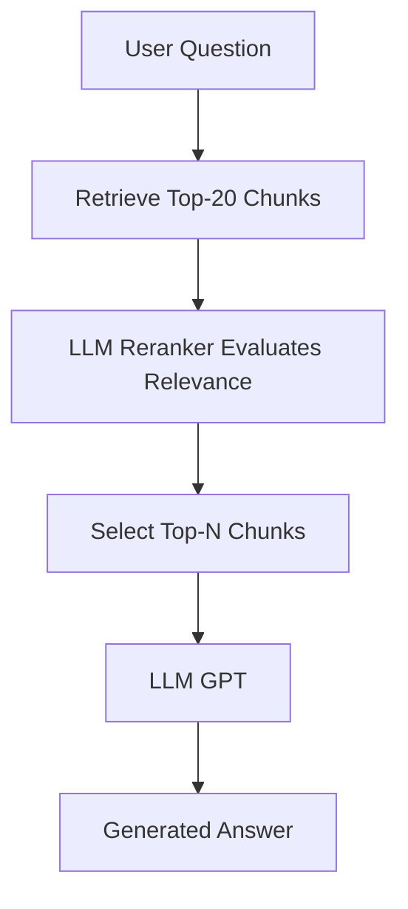

# 📚 PDF RAG 

This project implements **three distinct RAG (Retrieval-Augmented Generation) architectures**: Naive RAG, Parent RAG, and Rerank RAG.

> All approaches were used for a single PDF document, but vary in retrieval strategy and answer construction.

---

## 🧠 What is RAG?

RAG combines information retrieval (semantic search with embeddings) with text generation (LLM like GPT) to answer questions based on external data.

---

## 🔗 Technologies Used

- 📘 [LangChain](https://www.langchain.com/)
- 🧠 OpenAI GPT (Chat + Embeddings)
- 💾 [ChromaDB](https://www.trychroma.com/) - local vector store
- 🔤 [PyMuPDF](https://pymupdf.readthedocs.io/en/latest/) - PDF extraction
- 🧱 RecursiveCharacterTextSplitter (chunking)

---

## ✅ Implemented RAG Structures

### 1. 🧱 Naive RAG (simple)

> Retrieves the `top-k` chunks with embeddings and sends them directly to the LLM.



✅ **Advantages**: simple, fast, easy to implement  
⚠️ **Limitations**: isolated chunks may lose context

**Future improvements:**
- Dynamic adjustment of `k` based on question complexity
- Metadata filters (chapter, topic)
- Adaptive prompt according to question type

---

### 2. 🧩 Parent RAG (with extended context)

> Each small chunk points to a larger "parent document". After retrieving the chunks, it fetches the parents to ensure full context.



✅ **Advantages**: preserves full context of large sections  
⚠️ **Limitations**: may pass too much irrelevant content to the LLM

**Future improvements:**
- Group parents by semantic similarity
- Automatic truncation by max tokens
- Cache for already used parents

---

### 3. 🧠 Rerank RAG (relevance evaluated by LLM)

> Retrieves many chunks (`top-15~20`), then the LLM reranks them based on relevance to the question. The best are used in the answer.



✅ **Advantages**: improves accuracy by selecting only truly relevant chunks  
⚠️ **Limitations**: higher cost in LLM calls

**Future improvements:**
- Replace reranker with a local model (e.g., BGE-M3 or Cohere ReRank)
- Batch optimization for parallel scoring
- Rerank with metadata (chapter, character, location)

---

## 📊 Comparison Between Approaches

| Criteria              | Naive RAG | Parent RAG | Rerank RAG |
|----------------------|-----------|------------|------------|
| Implementation       | ✅ Simple | ⚠️ Moderate | ⚠️ Complex |
| Context Quality      | ❌ Low    | ✅ High     | ✅ High     |
| Computational Cost   | ✅ Low    | ⚠️ Medium   | ❌ High     |
| Answer Accuracy      | ⚠️ Variable | ✅ Good   | ✅ Excellent|

---

## 🚀 Next Steps (general)

- Web Interface
- Logging of questions and answers
- Automatic answer evaluation (semantic + human score)
- Support for conversational questions (continuous context)
- Side-by-side comparison of the 3 approaches

---

## 🏃‍♂️ How to Run the Project

Follow the steps below to run the RAG architectures locally:

1. **Clone the repository and access the folder:**
   ```zsh
   git clone <repo-url>
   cd pdf-rag
   ```

2. **Create and activate the Python virtual environment:**
   ```zsh
   python3 -m venv PY_VENV_RAG
   source PY_VENV_RAG/bin/activate
   ```

3. **Install dependencies:**
   ```zsh
   pip install -r requeriments.txt
   ```

4. **Create the folder to store your PDF:**
   ```zsh
   mkdir docs
   # store your PDF here
   ```

5. **Set environment variables:**
    Create a `.env` file with your OpenAI key:
     ```env
     OPENAI_API_KEY=
     ```

6. **Run the desired script:**
   Naive RAG:
     ```zsh
     python naive-rag.py
     ```
   Parent RAG:
     ```zsh
     python parent-rag.py
     ```
   Rerank RAG:
     ```zsh
     python rerank-rag.py
     ```

7. **Follow the terminal instructions to enter your question.**

---

## 👤 Author

Made with ♥ by Marcelo Galdino :wave: [Get in touch!](https://www.linkedin.com/in/marcelogaldino/)


## 📝 License

This project is distributed under the MIT license.
